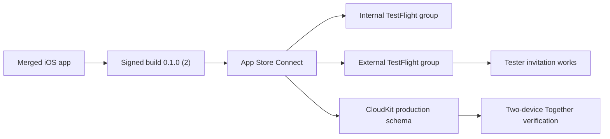

# 2026-07-16

## Session 1 — TestFlight release setup and CloudKit preparation

### Affected components

- iOS release metadata and signing
- App Store Connect and TestFlight
- CloudKit schema and partner sharing
- Production domain, DNS, and associated-domain verification
- GitHub release tracking

### What was done

- Merged the final metadata, domain, and CloudKit schema work through PRs #49–#51.
- Uploaded signed TestFlight candidate `0.1.0 (2)` for `dev.opentvtracker.app`.
- Verified the merged app launches successfully on the iOS 26.5 simulator.
- Configured the Friends & Family TestFlight flow and confirmed testing works.
- Diagnosed a revoked individual invite URL and documented that testers must use the newest invitation.
- Added the source-controlled CloudKit schema and production-promotion guide.
- Confirmed local `main` matches `origin/main` and that no pull requests remain open.

### Key decisions

- The product baseline remains iOS 26 with native Liquid Glass.
- The existing app icon remains canonical. A proposed redesign was reverted and PR #53 was closed unmerged.
- External testers should use an external TestFlight group unless they genuinely need App Store Connect user access.
- CloudKit production promotion was completed and verified in CloudKit Console.

### Files changed on `main`

- `CloudKit/OpenTVTracker.ckdb`
- `docs/CLOUDKIT_SCHEMA.md`
- `docs/PUBLIC_RELEASE_CHECKLIST.md`
- `README.md`
- iOS release metadata and domain configuration from PRs #49 and #50

### Mistakes and fixes

- A logo redesign was applied before approval. It was immediately reverted on its branch; PR #53 was closed without merging, and `main` retained the original icon.
- A stale TestFlight invitation was mistaken for a build problem. The build was healthy; the invitation token had been revoked or superseded.

### Next steps

- Verify Together invitation acceptance, bidirectional progress, offline retry, revoke, leave, and relaunch persistence.
- Log each beta bug as a separate GitHub issue with the existing `P0` label.
- Close GitHub issue #46 only after the two-device CloudKit acceptance test passes.
