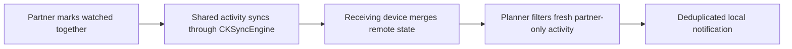

# 2026-07-17

## Session 1 — Partner watched-together notifications

### Affected components

- Together activity metadata and watch actions
- CloudKit change handling
- User notification authorization and foreground presentation
- Notification planning tests
- Xcode project generation

### What was done

- Confirmed that the app had CloudKit silent-sync support and push entitlements but no user-facing partner notification delivery.
- Added typed and timestamped watched-together activity metadata with backward-compatible decoding.
- Added fresh-event, partner-only, deduplicated notification planning and delivery.
- Applied remote CloudKit state as soon as `CKSyncEngine` fetches the shared record.
- Requested notification permission during partner connection and enabled foreground banners.
- Added focused planner and legacy-payload tests.
- Opened stacked PR #69 on top of notification/widgets PR #67.
- Fixed the Swift 6 notification delegate isolation failure reported by the first CI run.
- Confirmed all PR checks pass.

### Key decisions

- Notify only for the explicit `watchedTogether` action; ordinary personal watched activity remains private and silent.
- Reuse the notification permission established by the parent reminders branch.
- Suppress stale activity over 24 hours old, deduplicate activity IDs, and cap catch-up alerts at three per sync.
- Keep PR #69 unmerged until parent PR #67 lands and physical two-device acceptance passes.

### Files changed

- `OpenTVTracker/Data/PartnerActivityNotificationService.swift`
- `OpenTVTracker/Data/ServiceBoundaries.swift`
- `OpenTVTracker/Data/CloudKitSyncCoordinator.swift`
- `OpenTVTracker/Domain/MediaModels.swift`
- `OpenTVTracker/App/AppModel.swift`
- `OpenTVTracker/App/AppModel+CloudSync.swift`
- `OpenTVTracker/App/AppModel+Together.swift`
- `OpenTVTracker/App/AppModel+Episodes.swift`
- `OpenTVTracker/App/OpenTVTrackerApp.swift`
- `OpenTVTrackerTests/PartnerActivityNotificationTests.swift`
- `OpenTVTracker.xcodeproj/project.pbxproj`

### Mistakes and fixes

- The first foreground notification delegate used Swift concurrency syntax that crossed non-Sendable UIKit notification values into the main actor. CI caught it; the callback now uses the nonisolated completion-handler API.

### Next steps

- Merge PR #67, then retarget/rebase PR #69 to `main`.
- Complete a physical two-device check: permission prompt, background delivery, foreground banner, deduplication, and no alert for personal watch activity.
- Keep #46 and #62 open until CloudKit production sharing and the full two-device acceptance flow pass.
