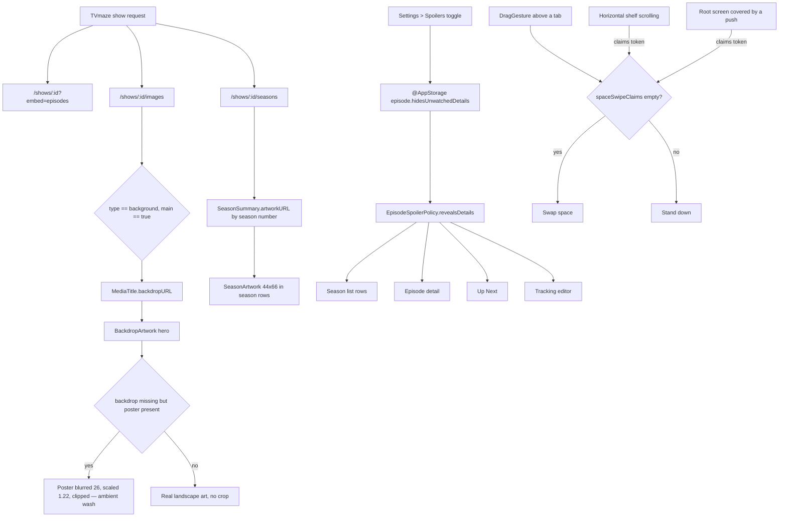
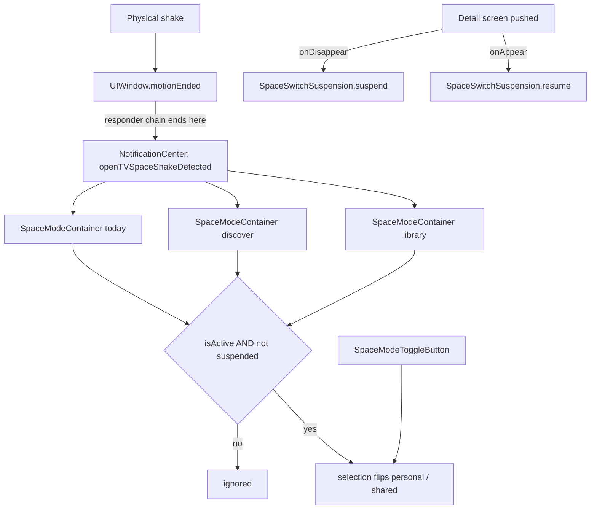

```mermaid
flowchart TD
    subgraph A["Bug A — hero settles mid-push"]
        A1[Detail screen pushed] --> A2["task(id:) refreshCatalogDetails"]
        A2 --> A3{"refreshed != existing?"}
        A3 -->|no| A4[No write, no re-render]
        A3 -->|yes| A5["titles[index] = refreshed, persist"]
        A5 --> A6[backdropURL arrives]
        A6 --> A7["hasStoodInForBackdrop latched: wash stays as floor"]
        A7 --> A8["Backdrop AsyncImage cross-fades over it, showsPlaceholder: false"]
    end

    subgraph B["Bug B — shelf flick swaps the room"]
        B1[HorizontalShelf] -->|"onGeometryChange, named space"| B2[SpaceSwipeExclusions box]
        B3["Root covered by a push"] -->|".infinite on onDisappear"| B2
        B4["DragGesture minimumDistance 20"] --> B5["ownsDrag(value)"]
        B2 --> B5
        B5 --> B6{"startLocation inside an exclusion?"}
        B6 -->|yes| B7[Stand down — shelf keeps the drag]
        B6 -->|no| B8{"width > height * 1.5?"}
        B8 -->|no| B7
        B8 -->|yes| B9["updating(\$drag): room follows the finger"]
        B9 --> B10{"travel or momentum >= max(80, width * 0.2)?"}
        B10 -->|yes| B11[Commit the swap]
        B10 -->|no| B12["@GestureState reset snaps home"]
    end
```

# Sessions: 2026-07-26

**Summary:** Answered three artwork questions from a live build — missing episode thumbnails, a cropped and bordered episode header, and colourless season rows — by replacing a hard-coded spoiler gate with an opt-in setting, sourcing real landscape and per-season art from TVmaze, and rendering season key art in every season list. Finished the space-swipe rework by arbitrating horizontal drags with claim tokens, then root-caused the two UI test failures that work exposed. Session 2 fixed two bugs found in the resulting build: a hero that tore itself apart mid-push, and the space swipe firing on shelf flicks — which reversed Session 1's claim-token arbitration for frame hit testing.

---

## Session 1: Episode and season artwork, spoiler setting, space-swipe arbitration

**Duration:** ~3 hours
**Status:** Complete
**Branch:** `fix/space-tint-and-hero-scrim` (PR #96)

### System flow



### Affected components

| Layer | Components |
| --- | --- |
| Design system | `EpisodeStillArtwork`, `SeasonArtwork`, `EpisodeSpoilerArtworkPlaceholder`, `PosterArtwork`/`BackdropArtwork` |
| Domain | `SeasonSummary.artworkURL`, `MediaTitle.backdropURL` |
| Data | `TVMazeCatalogService` concurrent enrichment, `TraktSyncEngine+History` season rebuilds |
| Features | Details (media, season, episode, tracking editor), Today, Discover, Library, Together, Settings, first run |
| Navigation | `SpaceModeContainer` swipe gesture, `HorizontalDragClaim`, `SpaceSwipeSuspension` |
| Tests | `UpcomingCalendarRefreshRaceTests`, `CoreJourneySmokeUITests` |

### What was done

- [x] Traced missing episode thumbnails to a hard-coded `isWatched` gate that blanked artwork, title, and summary on unwatched episodes — not a data gap.
- [x] Replaced the four drifting gates with one `EpisodeSpoilerPolicy.revealsDetails(isWatched:hidesUnwatchedDetails:)`, backed by `@AppStorage` and **off** by default.
- [x] Added the Spoilers toggle to Settings so the behaviour is discoverable rather than mysterious.
- [x] Gated `BackdropArtwork`'s square `strokeBorder` on `cornerRadius > 0`, removing a hard box drawn across five rounded containers while `CinemaView` keeps its intentional border.
- [x] Fetched real landscape art from `/shows/:id/images`, preferring `type == "background"` with `main == true`, so the hero stops cropping a portrait poster.
- [x] Kept a graceful stand-in: when only a poster exists, it is blurred 26, scaled 1.22, and clipped into an ambient wash instead of being stretched.
- [x] Added per-season art from `/shows/:id/seasons`, keyed by season number, preserved across both Trakt season-rebuild paths, and rendered 44×66 in every season row.
- [x] Ran the three TVmaze enrichment requests with `async let` so the extra art costs no extra latency.
- [x] Finished the space swipe: a directional, anywhere-on-screen drag arbitrated by `spaceSwipeClaims` tokens, with `claimsHorizontalDrag()` on 12 shelves and `suspendsSpaceSwipeWhenCovered()` on all four roots.
- [x] Root-caused and fixed the `UpcomingCalendarRefreshRaceTests` region-change flake; proved it with 60 iterations under artificial CPU load (failed on iteration 2 before, 60/60 after).
- [x] Root-caused and fixed both `CoreJourneySmokeUITests` failures.
- [x] Full suite green: 263 unit tests, 9 UI tests, plus a 5-iteration soak on both repaired UI tests.

### Key decisions

- **Decision:** Make episode-artwork hiding a setting, default off.
  - **Context:** The behaviour was unconditional, so a show you had never started rendered as a column of blank grey rectangles.
  - **Rationale:** It is real spoiler protection, but invisible protection reads as broken artwork. Opt-in keeps the intent and removes the confusion.

- **Decision:** Store the preference in `@AppStorage`, not `LibrarySnapshot`.
  - **Context:** Every other synced preference lives in the snapshot behind `schemaVersion`.
  - **Rationale:** This is a per-device display choice, so it does not belong in synced state and needs no schema bump.

- **Decision:** One `EpisodeSpoilerPolicy` helper instead of four inline `isWatched` checks.
  - **Context:** Four surfaces gate on the same rule: season rows, episode detail, Up Next, tracking editor.
  - **Rationale:** Four copies of one rule is four chances to drift. A single call site cannot.

- **Decision:** Gate the artwork stroke on `cornerRadius > 0` rather than adding a `showsBorder` flag.
  - **Context:** Every `cornerRadius: 0` call site is a fill inside another clipping container.
  - **Rationale:** The radius already encodes the answer; a second parameter would let the two disagree.

- **Decision:** Blur a standing-in poster rather than letter-boxing or stretching it.
  - **Context:** Not every show returns landscape art, and the hero is a wide frame.
  - **Rationale:** A blurred wash carries the title's colour and reads as deliberate; a stretched poster reads as a bug.

- **Decision:** Arbitrate the space swipe with claim tokens instead of a screen-edge anchor or coordinate heuristics.
  - **Context:** The gesture sits above a whole tab, so it sees every sideways pan, including a dozen shelves and anything pushed over a root.
  - **Rationale:** The regions that own a horizontal drag are the ones that know it. Reserving a screen edge instead would have made the switch hard to find and would still have fought `NavigationStack`'s interactive pop.

- **Decision:** Sample claim eligibility once in `onChanged`, not in `onEnded`.
  - **Context:** A shelf that took the drag can coast back to idle and drop its claim before the finger lifts.
  - **Rationale:** The question is who owned the gesture when it started, not who owns it when it ends.

- **Decision:** Fix the calendar-refresh flake in the test's synchronization, not in the model.
  - **Context:** `setStreamingRegionOverride` starts its own refresh task, so which task completes the GB pass is a scheduling detail that flips under load.
  - **Rationale:** The model's behaviour was correct. The test asserted on a race it did not own, so it now waits for the result and keeps its stale-rejection teeth via an exact observed-set assertion.

### Files changed

Source (24 files):

- `OpenTVTracker/DesignSystem/EpisodeStillArtwork.swift` — `EpisodeSpoilerPolicy`, `fallbackURL`, `SeasonArtwork`, spoiler placeholder.
- `OpenTVTracker/DesignSystem/PosterArtwork.swift` — stroke gated on `cornerRadius > 0`; blurred poster stand-in for the hero.
- `OpenTVTracker/Data/TVMazeCatalogService.swift` — concurrent detail/images/seasons enrichment, `optionalRequest`, image and season DTOs.
- `OpenTVTracker/Data/TraktSyncEngine+History.swift` — preserves `artworkURL` when rebuilding an existing season.
- `OpenTVTracker/Domain/MediaModels.swift` — `SeasonSummary.artworkURL`.
- `OpenTVTracker/App/RootTabView.swift` — claim environment, `HorizontalDragClaim`, `SpaceSwipeSuspension`, directional swipe.
- `OpenTVTracker/App/AppModel+WatchEvents.swift`, Features/Details (5), Features/Discover (5), Features/Today, Features/Library, Features/Together (2), Features/Settings, Features/Onboarding — spoiler gates, claim call sites, Settings toggle.

Tests (2 files):

- `OpenTVTrackerTests/UpcomingCalendarRefreshRaceTests.swift` — `awaitingSeason(_:titleID:)` helper and exact observed-season assertion.
- `OpenTVTrackerUITests/CoreJourneySmokeUITests.swift` — directional swipe helpers, `assertDisappears`, return-leg coverage, Library section menu path.

### Mistakes and fixes

- **Claim token leaked on a space swap.** `SpaceSwipeSuspension` claimed on `onDisappear`, which fires when the removal transition completes — after `onChange(of: selection)` had already cleared the set. The retired root therefore left a token nothing could hand back, and the return swipe was silently dropped. Fixed by claiming only when the modifier's own space is still the selected one; the binding reads live state, so it already names the destination by then. Root cause was in the product, not the test: `testSpaceSwipeCarriesBackToPersonal` was right to fail.
- **A UI test drove a control that no longer exists.** `openViewingDiary()` tapped a segmented `History` button removed in `d11c4c8`, with a dead `library.profile` fallback branch above it that had never existed in the app. Retargeted at `library.section-menu` → History → `library.viewing-diary`. This failure was pre-existing on HEAD, not caused by this session's work.
- **Handoff notes were written outside the repository** and lost to a context clear; recovered from the session scratchpad. Session documentation now rides the same commit.
- **A Python-based insert mis-anchored** on an indentation assumption (16 spaces, not 12). It failed the assertion rather than writing a partial edit, so nothing was corrupted.

### Next steps

- [ ] Promote "In Theaters" to a full screen from `DiscoverView.swift:29` and rename it away from "In cinemas". (Deferred — HANDOFF TODO 4.)
- [ ] Unify the Today and Discover component vocabulary. (Deferred — HANDOFF TODO 5.)
- [ ] Watch for shows whose TVmaze `background` art is lower resolution than the poster; the stand-in path may be preferable for those.

---

## Session 2: Hero settling animation and shelf drags stealing the space switch

**Duration:** ~4 hours
**Status:** Complete
**Branch:** `fix/space-tint-and-hero-scrim` (PR #96)

Two bugs reported from a live build of Session 1's work.

### System flow



### Affected components

| Layer | Components |
| --- | --- |
| Design system | `BackdropArtwork`, `NetworkArtwork.showsPlaceholder`, new `HorizontalShelf` |
| App | `AppModel.refreshCatalogDetails` write gate, `SpaceSwipeExclusions`, `SpaceSwipeGeometry`, `HorizontalDragClaim`, `SpaceSwipeSuspension`, `SpaceModeContainer` |
| Features | Details, Today, Discover (4 files), Library, Together — 12 shelves migrated to `HorizontalShelf` |
| Fixtures | `SampleData.coreJourneyUITest` gains `catalogShelfPicks` |
| Tests | `HorizontalShelfRegistrationTests`, `CoreJourneySmokeUITests.testDragStartingInAShelfScrollsItAndKeepsTheSpace` |

### What was done

- [x] Root-caused the hero's "weird resize" to two independent causes, not one: an unconditional model write on every detail appearance, and a hero whose entire presentation was derived from `backdropURL` changing.
- [x] Gated the catalog write on `refreshed != existing`, so an already-enriched title no longer re-renders the screen and re-persists the library mid-push.
- [x] Latched `hasStoodInForBackdrop` so the blurred poster wash stays as a floor once used; the real artwork now cross-fades over something that never moves, instead of the wash unblurring and unscaling while an `AsyncImage` resets to a spinner.
- [x] Added `NetworkArtwork.showsPlaceholder` so artwork layered over a filled frame stays transparent until it has pixels, and `failure`/`unknown` no longer drop a gradient over a visible image.
- [x] Replaced scroll-phase claim tokens with frame hit testing: regions publish their rect via `onGeometryChange` into a plain reference box, and the gesture tests the touch-down point once.
- [x] Introduced `HorizontalShelf` as the single way to build a horizontal carousel, with registration built in, and migrated all 12 shelves onto it.
- [x] Added `HorizontalShelfRegistrationTests`, which scans app sources for a raw `ScrollView(.horizontal` without `claimsHorizontalDrag()` — making "a new shelf can't forget" a guarantee rather than a convention.
- [x] Added follow-the-finger: the room tracks the drag through `@GestureState`, resists at 20% when there is no destination that way, and snaps home if released short of the threshold.
- [x] Extended the core-journey UI seed with six planned, poster-bearing catalog titles so Today's "Start watching" shelf actually renders under test.
- [x] Added `testDragStartingInAShelfScrollsItAndKeepsTheSpace`, covering the exact reported case, and proved it load-bearing with a negative check.
- [x] Full suite green: 264 unit tests, 10 UI tests.

### Key decisions

- **Decision:** Hit-test published frames instead of racing scroll phases. **Reverses Session 1's "arbitrate with claim tokens" and "sample eligibility once in `onChanged`".**
  - **Context:** A scroll view only reports a phase once it has recognized its own pan (~10pt), while the space gesture wakes at 20pt of travel, and nothing orders the two.
  - **Rationale:** That race was unwinnable — a flick across a shelf was a coin flip, which is exactly the bug reported. A frame is known before the finger lands, so the same question has a deterministic answer. Sampling-once existed only to paper over the race; hit testing is idempotent, so `ownsDrag` is simply recomputed in both callbacks.

- **Decision:** Keep the exclusion set in a plain `@MainActor` reference box, outside SwiftUI's observation.
  - **Context:** A shelf inside a vertically scrolling screen republishes its frame every frame of every scroll — a dozen shelves at display rate.
  - **Rationale:** `@State` or `@Observable` would invalidate an entire tab's body on each tick to inform one gesture that reads the set once per drag. A box has no observers to notify.

- **Decision:** Express "a detail screen is covering this root" as an infinite rect.
  - **Context:** A cover is not a region on screen; no sideways drag anywhere belongs to the switch while a push is up.
  - **Rationale:** An infinite rect contains any finite point, so one hit test answers both questions and the gesture carries one mechanism instead of two.

- **Decision:** Make `HorizontalShelf` a component rather than documenting the modifier.
  - **Context:** Twelve call sites each had to remember `claimsHorizontalDrag()`.
  - **Rationale:** A rule twelve sites remember is one the thirteenth breaks. The user asked for exactly this ("so a new shelf can't forget to register"), and the source-scanning test makes it enforceable rather than aspirational.

- **Decision:** `@GestureState` for the drag offset, not `@State`.
  - **Context:** A gesture interrupted by a phone call never reaches `onEnded`.
  - **Rationale:** Plain state would leave the room shoved permanently off-centre with no way back. `@GestureState` resets on cancellation as well as clean end, and its reset transaction is what animates the snap home.

- **Decision:** Latch the poster wash rather than deriving it from `backdropURL` alone.
  - **Context:** Enrichment fills `backdropURL` while the push is still animating.
  - **Rationale:** Deriving everything from that one field meant the hero rebuilt itself at the worst possible moment. A floor behind an opaque image costs nothing, and removing it is what made the swap visible.

### Files changed

Source (13 files):

- `OpenTVTracker/DesignSystem/PosterArtwork.swift` — latched wash, layered backdrop, `showsPlaceholder`.
- `OpenTVTracker/App/AppModel+Catalog.swift` — write gated on an actual change, for both `titles` and `catalogSearchResults`.
- `OpenTVTracker/App/RootTabView.swift` — `SpaceSwipeExclusions`, `SpaceSwipeGeometry`, frame-publishing claim modifier, follow-the-finger offset with resistance.
- `OpenTVTracker/DesignSystem/Theme.swift` — `HorizontalShelf`.
- `OpenTVTracker/Domain/SampleData.swift` — `catalogShelfPicks` appended to the core-journey seed.
- Features/Details, Features/Today, Features/Discover (4), Features/Library, Features/Together — 12 shelves migrated.

Tests (2 files):

- `OpenTVTrackerTests/DiscoverCategoryTests.swift` — `HorizontalShelfRegistrationTests` source scan.
- `OpenTVTrackerUITests/CoreJourneySmokeUITests.swift` — shelf-drag coverage plus `assertNeverAppears`.

### Mistakes and fixes

- **The failing UI test was a fixture gap, not a view bug.** The core-journey seed held one title — watching, on the watchlist, no poster — so `browsableCatalogTitles` returned empty and the shelf never rendered. An earlier hypothesis blamed accessibility grouping on a bare `VStack`; that was tested and disproved, and the modifiers were kept on their own merits.
- **`isHittable` on a container is not a proxy for its children being on screen.** Scrolling to the section was satisfied the moment its heading cleared the fold, while the carousel sat at y=799 on an 874pt screen. Two failures came from this. `swipeLeft()` diagnosed it where a coordinate press-drag could not: it errors with "visible frame is empty, which may happen if the element is offscreen" instead of silently no-opping.
- **A first attempt at the catalog write gate skipped too much.** `guard refreshed != existing else { return }` also skipped the `catalogSearchResults` update, which is a separate array with its own staleness. Restructured into two independent conditions.
- **`assertDisappears` cannot express "never appeared".** Waiting for `exists == false` is satisfied instantly by an absent element, so proving a gesture did *not* switch spaces needed an inverted `waitForExistence`.
- **A half-applied edit** left trailing `.scrollIndicators`/`.claimsHorizontalDrag()` modifiers behind in `DiscoverComponents.swift` after the container was swapped; caught by the build.

### Verification

- `xcodebuild build-for-testing` → `** TEST BUILD SUCCEEDED **`.
- `-only-testing:OpenTVTrackerTests` → 264 tests, 0 failures (263 → 264 confirms the new source scan ran).
- `-only-testing:OpenTVTrackerUITests` → 10 tests, 0 failures.
- **Negative check on the shelf-drag test:** replacing the exclusion guard in `ownsDrag` with `guard true` reproduced the user's exact symptom — `Expected "Test couch" StaticText never to appear` — proving the test fails when the fix is absent. Reverted verbatim and re-run green.
- **Negative check on the source scan:** reverting `LibraryShelfPicker` to a bare `ScrollView(.horizontal)` made the guard fail, proving it was not passing vacuously.

### Next steps

- [ ] Both Session 1 deferrals still stand (In Theaters full screen; Today/Discover vocabulary).
- [ ] Consider whether `SpaceSwipeSuspension`'s `.infinite` rect should also cover sheets, not just pushes — untested, and sheets currently sit above the gesture anyway.

---

## Session 3: Backdrop sourcing, mark-whole-show-watched, pick banner, shake to switch spaces

### System flow



### Affected components

- **App shell** — `RootTabView`, `OpenTVAppDelegate`.
- **Design system** — `HorizontalShelf`.
- **Features** — Today (recommendation banner), Details (overflow menu).
- **Domain** — watch events / analytics for whole-show completion.

### What was done

- [x] Hero backdrop no longer resizes mid-push (`MediaDetailView`); TVMaze background ordering corrected.
- [x] **Mark whole show watched** in the details overflow menu, gated on `hasUnwatchedReleasedEpisodes`, routed through the per-episode primitive so analytics credits every episode's runtime rather than one.
- [x] **"A pick for tonight"** rebuilt as a full-bleed `AdaptiveHeroSurface` banner with backdrop art, a tappable title block, and an icon-only action row (add / explore / hide). The hide button finally surfaces `setRecommendationDismissed`, which had existed with no UI.
- [x] **Shake replaces the space swipe.** `DragGesture`, `SpaceSwipeExclusions`, `SpaceSwipeGeometry`, `claimsHorizontalDrag()` and the follow-the-finger offset are all gone.

### Key decisions

- **Decision:** Detect the shake on `UIWindow`, not on a view.
  - **Rationale:** UIKit delivers motion events to the first responder and then up the chain. Discover's search field alone would blind a view-level detector while the keyboard is up. The window is the last stop on every chain, so nothing can take the event first.
- **Decision:** Gate on an explicit `isActive` flag rather than toggling in place.
  - **Rationale:** One `SpaceModeContainer` is mounted per tab and every visited tab stays mounted, so a single notification reaches all three. Three sequential flips of the same binding net to one wrong flip.
- **Decision:** Keep the suspension registry per-container, and keep its `guard selection?.wrappedValue == space` check.
  - **Rationale:** A single app-wide registry would be permanently poisoned by an ordinary tab switch, whose leaving root fires `onDisappear`. The guard stops a space-swap-triggered `onDisappear` from placing a hold nothing can release.
- **Decision:** `applicationSupportsShakeToEdit = false`.
  - **Rationale:** Shake-to-undo would otherwise eat the same gesture behind a system alert. Nothing in the app edits text outside a field with its own undo.
- **Decision:** Delete `HorizontalShelfRegistrationTests` wholesale.
  - **Rationale:** Its entire premise — every horizontal shelf must register with the space swipe — died with the swipe. Keeping it would have enforced a rule that no longer exists.
- **Decision:** Drive the UI tests through `space-mode-toggle`, not a synthesised shake.
  - **Rationale:** XCUITest cannot generate a shake; the Simulator only offers it from the Hardware menu. The toolbar button is not a test-only affordance — it is the switch for anyone who cannot shake the phone, and VoiceOver's only path to it.

### Files changed

Source:

- `OpenTVTracker/App/RootTabView.swift` — `openTVSpaceShakeDetected`, `UIWindow.motionEnded` override, `SpaceSwitchSuspension`, `CoveredSpaceSuspension`, `isActive` on the container; swipe apparatus removed.
- `OpenTVTracker/App/OpenTVTrackerApp.swift` — `applicationSupportsShakeToEdit = false`.
- `OpenTVTracker/DesignSystem/Theme.swift` — `HorizontalShelf` no longer registers a drag claim.
- `OpenTVTracker/App/AppModel+WatchEvents.swift`, `AppModel+Episodes.swift` — series `markWatched` routed through the episode primitive.
- `OpenTVTracker/Features/Details/MediaDetailActions.swift` — gated "Mark whole show watched".
- `OpenTVTracker/Features/Details/MediaDetailView.swift` — hero aspect ratio.
- `OpenTVTracker/Data/TVMazeCatalogService.swift` — background ordering.
- `OpenTVTracker/Features/Today/TodayGuidanceCards.swift` — recommendation banner.
- Today / Discover / Library / Together — `suspendsSpaceSwitchWhenCovered()` rename.

Tests:

- `OpenTVTrackerTests/DiscoverCategoryTests.swift` — `HorizontalShelfRegistrationTests` deleted.
- `OpenTVTrackerTests/AppModelTests.swift` — whole-show completion coverage.
- `OpenTVTrackerUITests/CoreJourneySmokeUITests.swift` — `testSpaceToggleCarriesBackToPersonal`, `testNoSidewaysDragSwitchesSpaces`.

### Mistakes and fixes

- **Assumed the shake needed a new visible control.** `SpaceModeToggleButton` already shipped on every root via `spaceModeToolbar()`. The work was fixing its now-false hint, not building a button.
- **Nearly let all three containers answer the same shake.** Caught in design, before any code — hence `isActive`.
- **Nearly called the file-private `applyEpisodeWatchState` cross-file.** `private` on an extension member is file-scoped; the codebase pattern is an internal entry point in the same file delegating to the private primitive.
- **First whole-show implementation credited one episode's runtime to a whole series.** Analytics counts events, not flags — one series-scoped event is one `ViewingPlay`.

### Verification

- `xcodebuild build` → `** BUILD SUCCEEDED **`.
- Full `xcodebuild test` → `** TEST SUCCEEDED **`, all unit and UI suites green, including both rewritten space-switch tests.

### Known environment finding (not a code change)

The Simulator cannot reach the TMDB proxy: App Attest is unavailable there, so the proxy's attestation check rejects every request and artwork silently falls back to TVMaze. That is why every screenshot in this session showed TVMaze art. It is a local-environment setup step, not an app bug, and was deliberately left unmade.

### Next steps

- [ ] Both earlier deferrals still stand (In Theaters full screen; Today/Discover vocabulary).
- [ ] Verify the pick banner and the shake visually on device — the shake cannot be exercised by CI at all.

---

## Session 4: App Attest dev path, and five visual defects across Today, Settings, Library

Six screens' worth of feedback, all visual, plus closing out the proxy path that
made the artwork look wrong in the first place.

### System flow

```text
Simulator ──X App Attest unavailable ──> proxy rejects ──> TVMaze fallback art
   │
   └── DEBUG only: X-OpenTV-Development-Token ──> proxy (APP_ATTEST_MODE=development) ──> TMDB
```

```text
NetworkArtwork
  Color.clear  (size authority — accepts the proposal, reports it back)
    └ overlay { AsyncImage phases }   ← phases no longer vote on size
```

### Affected components

- Frontend only. No backend, schema, or API change.
- Local config: `Config/Secrets.xcconfig`, `server/.env` (both untracked, values never printed).

### What was done

- [x] **App Attest development path wired end to end.** Generated the shared bypass token,
      set it on both ends, repointed `CATALOG_PROXY_BASE_URL` at `localhost:8787`, and
      verified through the *built bundle* that the xcconfig `/$()/` escape resolves.
      `/health` → 200; catalog search → 401 without the header, real TMDB with it.
- [x] **Thumbnail zoom animation** — the "still weird" one, fixed in the shared loader.
- [x] **Today title never collapsed into the bar** — hand-rolled header replaced with
      `.navigationTitle` + `.navigationSubtitle`.
- [x] **Today toolbar icons were accent blue** — per-item `.tint(Color.primary)`.
- [x] **Pick banner buttons rendered ~80pt across** — circles drawn at an exact 44pt.
- [x] **Settings "Portable backup" row several hundred points tall** — deterministic `HStack`.
- [x] **Library shelf filters redesigned** — text chips, all six inline, counts.

### Key decisions

- **`Color.clear` is the size authority in `NetworkArtwork`, not the image.**
  `AsyncImage` reports the size of whichever phase it is showing, and the phases disagree:
  the placeholder reported a fixed 150pt circle drawn as a sibling, a `.success` image
  reports its `scaledToFill` size. The swap runs inside a 0.25s transaction, so SwiftUI
  animated that disagreement — read as "zooming in and reduce size" on every thumbnail in
  the app. Fixing it in `NetworkArtwork` fixes posters, backdrops and thumbnails at once;
  `AdaptiveHeroSurface` had already taken the same route for the hero, which is why the
  earlier hero-only fix did not generalise. The placeholder circle was demoted from a
  `ZStack` sibling to an `.overlay` so it can no longer report a size either. Every
  `PosterArtwork` call site was audited first: all supply a bounded proposal, so
  `Color.clear`'s 10×10 ideal size is never consulted.
- **The greeting is the *navigation* title.** Drawn inside the scroll content it could
  never collapse into the bar, and it shared a row with the toolbar icons rather than
  passing under them — the greeting ran straight into the calendar glyph. `LibraryView`
  has had the right shape all along. First use of `.navigationSubtitle` in the repo
  (iOS 26 deployment target).
- **Toolbar tint is per item.** `ToolbarItemGroup` is toolbar content, not a `View`, so
  there is nothing above the three items to hang one modifier on — the first attempt
  failed to compile for exactly that reason. Without it they inherit the space tint from
  `SpaceModeContainer` and every bar icon comes out the same blue as the content CTAs.
- **`.bordered` + `minimumTouchTarget()` + `.controlSize(.large)` compound.** The style
  padded a frame that was already 44pt and the large size scaled that padding again, so
  three "small icon buttons" rendered close to 80pt across. Drawing the circle at an exact
  `AppAccessibility.minimumTouchTarget` under `.buttonStyle(.plain)` keeps the target
  honest and stops the styles arguing.
- **`LabeledContent`'s ViewBuilder slot gives its content unbounded height.** A `Label`
  handed that grows to fill it — one line of backup status became a row several hundred
  points tall beside the single-line Trakt row above. The `value:` String form does not
  behave this way; a hand-laid `HStack` is deterministic.
- **Library filters: all six shelves inline, no ellipsis menu.** Dropping the SF Symbols is
  what buys the width back — the words already name the shelves, and icon + text + glass
  over 44pt is what read as chunky. Caught Up and Dropped no longer hide behind a second
  tap and a label that changed identity with the selection. A per-shelf count carries the
  information the icon never did; empty shelves say so by showing none.
- **`LibraryShelf.primary`/`.secondary` deleted rather than left dangling.** They existed
  only to feed the old split, and a test asserted that split as an invariant. The invariant
  is now "every shelf is reachable, in ownership order", asserted over `allCases`.

### Files changed

- `OpenTVTracker/DesignSystem/PosterArtwork.swift` — `Color.clear` size authority; placeholder circle demoted to overlay.
- `OpenTVTracker/Features/Today/TodayView.swift` — nav title/subtitle, `greeting`, per-item toolbar tint.
- `OpenTVTracker/Features/Today/TodayGuidanceCards.swift` — `TodayHeader` deleted; `actionRow`/`iconButton` rewritten.
- `OpenTVTracker/Features/Settings/AppSettingsView.swift` — backup row laid out by hand.
- `OpenTVTracker/Features/Library/LibraryView.swift` — `LibraryShelfPicker` redesigned; `primary`/`secondary` removed.
- `OpenTVTrackerTests/LibraryOrganizationTests.swift` — split invariant replaced with an `allCases` one.

### Mistakes and fixes

- **First diagnosis of the thumbnail zoom blamed the outer frame.** It could not be: the
  `.frame(maxWidth:.infinity, maxHeight:.infinity)` clamps to a definite 70×96 proposal.
  The motion was *inside* that frame, in `AsyncImage`'s own reported size.
- **`.tint(.primary)` on a `ToolbarItemGroup` does not compile.** Group is not a `View`.
- **Left the Library filter complaint unaddressed across sessions.** It was a repeat ask —
  "not the first time i told you that". Carried forward now as a fixed invariant plus a test.

### Verification

- `xcodebuild build` (iPhone 17 Pro) → `** BUILD SUCCEEDED **`.
- `xcodebuild test -only-testing:OpenTVTrackerTests` → 265 tests, 0 failures, `** TEST SUCCEEDED **`.
- Proxy dev path exercised by hand: `/health` 200, search 401 without token, real TMDB payload with it.

### Not a bug

The pick banner reads blurry because `backdropURL` is nil, so `BackdropArtwork` falls back
to `posterWash` at `blur(radius: 26)` — a 2:3 poster centre-cropped into a 16:9 slot loses
exactly the thirds carrying its title treatment, so the blur is deliberate. It disappears
the moment the proxy is running and real landscape art arrives.

### Next steps

- [ ] `cd server && bun run dev` before evaluating any artwork — the proxy is not running.
- [ ] Both earlier deferrals still stand (In Theaters full screen; Today/Discover vocabulary).
- [ ] Verify the pick banner, the new chips, and the shake on device — the shake cannot be exercised by CI.
- [ ] Today's *leading* space-toggle glyph still inherits the space accent; tint it too if it reads wrong.

---

## Session 3 — CodeRabbit triage, TestFlight release wiring

### What was done

- [x] Triaged the four unresolved CodeRabbit threads blocking PR #96.
- [x] Fixed the one legitimate finding: `appSpaceMode` was never installed for the partner
      surfaces, so their backdrop stayed personal while every control was tinted shared.
- [x] Wired `CATALOG_PROXY_BASE_URL` into the TestFlight archive; added an https guard.

### Key decisions

- **Three of the four CodeRabbit threads were dismissed with reasons.** All three concern
  `UpcomingCalendarRefreshRaceTests.swift`. The one marked *Critical* claims
  `XCTAssertEqual(observedSeasonIDs, ["gb-season"])` cannot type-check because a `Set` is
  being compared to an array. `Set` is `ExpressibleByArrayLiteral`, so the literal infers as
  `Set<SeasonSummary.ID>` and the overload resolves — and `build-and-test`, which compiles
  this exact target, passed on this head. A required check that compiles the code outranks a
  reviewer assertion about whether it compiles. The other two flag the unbounded `while true`
  in `awaitingSeason`; that is deliberate and documented in the helper's own doc comment —
  a season that never arrives is a hang the XCTest timeout reports, which is a better failure
  than a bounded loop silently downgrading the assertion to "didn't see it in time".

- **The onboarding backdrop follows the step rather than the whole flow.** `AmbientBackdrop`
  animates on `appSpaceMode`, so deriving it from `step` makes advancing to the partner step
  cross-fade the ambient wash into the hue the controls already carry, instead of switching
  the entire onboarding flow to a shared tint it does not deserve.

- **The release archive had no proxy URL at all.** `Config/Secrets.xcconfig` is gitignored,
  so a CI archive baked an empty `OpenTVAPIBaseURL` into `Info.plist`. The app would have
  fallen through to the public TVMaze catalog on TestFlight without surfacing anything —
  the exact silent degradation that reads as "the artwork is bad again". Passed from a repo
  variable, not a secret: the endpoint is public and guarded by App Attest.
  `APP_ATTEST_DEVELOPMENT_TOKEN` is pinned empty in the archive, belt-and-braces over the
  `#if DEBUG` gate in `AppServiceConfiguration`.

### Files changed

- `OpenTVTracker/Features/Onboarding/FirstRunView.swift` — step-derived `appSpaceMode`.
- `OpenTVTracker/Features/Together/PartnerInvitationView.swift` — `appSpaceMode` set to `.shared`.
- `.github/workflows/testflight.yml` — proxy URL passed to `archive`; https validation; token pinned empty.

### Verification

- `xcodebuild build` (iPhone 17 Pro) → exit 0, zero errors.

### Blocker for the partner test

The Render proxy answers `503` with `x-render-routing: suspend-by-user` — the service is
suspended in the Render dashboard. Until it is resumed, a TestFlight build reaches no proxy
and falls back to TVMaze artwork. Sharing itself is unaffected: `CKShare` never touches the
proxy. The URL is baked in, so resuming the service fixes artwork without a rebuild.

### Next steps

- [ ] Resume the Render service, then tag `v0.1.0` and dispatch the TestFlight workflow.
- [ ] `CloudKitPartnerSharingService` still has zero test references — the model logic is
      proven by 36 tests over fakes, the transport is not. Two devices are the only proof.

## Session 4 — first release, and the signing conflict it exposed

PR #96 merged (squash, `fde16b9`). Tag `v0.1.0` — the first tag in the repository — pushed
and the TestFlight workflow dispatched. The archive failed, and the failure was a real
project defect rather than a CI accident.

### The failure

```text
OpenTVWidgets has conflicting provisioning settings. OpenTVWidgets is automatically signed,
but code signing identity 8B04DD86… has been manually specified.
```

Reported for all three targets — the app, the widget extension, and the ZIPFoundation
package target.

### Two causes, both fixed

**1. The workflow contradicted itself.** `Archive release` passed `CODE_SIGN_STYLE=Automatic`
alongside a resolved SHA-1 `CODE_SIGN_IDENTITY`. A command-line build setting applies to
every target in the graph, which is why a package checkout was implicated in a signing
argument it has no stake in. Automatic signing chooses the identity itself; naming one
is the contradiction. The flag is gone, and the certificate lookup that fed it is now
purely a count check — one distribution certificate, no more, no fewer.

**2. The Release configuration asked for a development certificate.** `CODE_SIGN_IDENTITY =
"iPhone Developer"` was pinned in the app target's *Release* config — the legacy alias for
Apple Development. It survived because every prior build of this project was a Debug
simulator build, where it is correct and never consulted otherwise. The first archive ever
attempted is the first thing to read it. Both Release configs now name `Apple Distribution`;
the widget extension had no pin at all and inherited the SDK default, which resolved to
Apple Development and would have failed the same way one step later.

### Verification

`-showBuildSettings -configuration Release` now reports `Apple Distribution` for both
targets, and Debug still reports `Apple Development` — local development is untouched.

### Files changed

- `.github/workflows/testflight.yml` — dropped the explicit identity; trimmed the lookup.
- `OpenTVTracker.xcodeproj/project.pbxproj` — `Apple Distribution` on both Release configs.

## Session 5 — the archive's second failure: App Store Connect authentication

The signing-conflict class is gone; the next dispatch failed differently.

### The failure

```text
error: Authentication failed: Make sure a bearer token was provided, it is properly
configured and signed, and it has not expired. (in target 'OpenTVTracker')
error: No profiles for 'dev.opentvtracker.app' were found: Xcode couldn't find any iOS
App Development provisioning profiles matching 'dev.opentvtracker.app'.
```

The second line is a symptom, not a second defect. Authentication failed, so Xcode could
neither query nor create a profile, and it falls back to generic *development*-profile
phrasing regardless of the identity actually configured. Chasing that sentence leads back
to the signing settings, which are correct.

The certificate is provably fine — the identity count check imported exactly one
`Apple Distribution` certificate — which isolates the App Store Connect API key path.

### What was wrong with the diagnosis path

`APPLE_API_PRIVATE_KEY_P8_BASE64` was decoded with no validation whatsoever. A secret
holding the `.p8` file's PEM text rather than its base64 encoding — the obvious mistake,
since Apple hands over a PEM file — decodes to garbage and produces exactly this error,
ten minutes into a compile, with nothing pointing at the key.

### Fixes

- **Accept both forms of the key.** PEM text passes through untouched; anything else is
  base64-decoded. This removes the whole class of setup error rather than detecting it.
- **Validate the result** with `openssl pkey`, so a malformed key fails in the step that
  owns it.
- **Preflight App Store Connect** with `altool --list-apps` before the archive. A rejected
  key now says so by name, and an authenticated key that cannot see an app record for
  `dev.opentvtracker.app` says that instead — the two need different remedies and
  previously produced identical output.

### Files changed

- `.github/workflows/testflight.yml` — key-format tolerance, key validation, ASC preflight.

## Session 6 — the preflight passed and the archive still failed

Which is the most informative result available. `altool --list-apps` authenticated with the
key and found the app record, then `xcodebuild` reported `Authentication failed` for the
same key seconds later.

### What that proves

The key is valid, the IDs match it, and `dev.opentvtracker.app` exists in App Store Connect.
What xcodebuild needs is not App Store Connect *read* access but *provisioning* access —
the bundle identifiers and profiles under Certificates, Identifiers & Profiles. An
individual key, or a team key with the Developer role, passes the first and fails the
second. The preflight was asking the wrong API and reported a clean bill of health for a
credential that cannot do the job.

### Fix

The preflight now mints an ES256 JWT from the key and calls `/v1/bundleIds`, which is the
capability xcodebuild actually exercises, and reads the status code as a diagnosis:

- `401` — the key is rejected outright; check the key, key ID and issuer ID agree.
- `403` — authenticated but not permitted to provision; a team key with App Manager or
  Admin is required.
- `200` — then both bundle identifiers must be registered, which is checked explicitly.

`openssl` signs but emits DER, and a JWT wants the bare `r‖s` pair, so a short Python step
unwraps it. Verified locally against a throwaway P-256 key: 64-byte signature, decodable
header.

### Files changed

- `.github/workflows/testflight.yml` — provisioning-scoped preflight replacing the ASC read check.
