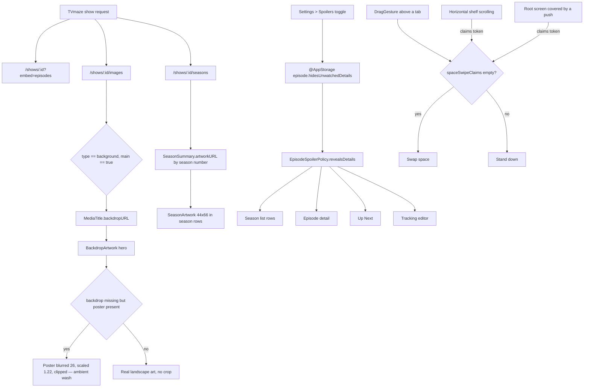

# Sessions: 2026-07-26

**Summary:** Answered three artwork questions from a live build — missing episode thumbnails, a cropped and bordered episode header, and colourless season rows — by replacing a hard-coded spoiler gate with an opt-in setting, sourcing real landscape and per-season art from TVmaze, and rendering season key art in every season list. Finished the space-swipe rework by arbitrating horizontal drags with claim tokens, then root-caused the two UI test failures that work exposed.

---

## Session 1: Episode and season artwork, spoiler setting, space-swipe arbitration

**Duration:** ~3 hours
**Status:** Complete
**Branch:** `fix/space-tint-and-hero-scrim` (PR #96)

### System flow

### Affected components

| Layer | Components |
| --- | --- |
| Design system | `EpisodeStillArtwork`, `SeasonArtwork`, `EpisodeSpoilerArtworkPlaceholder`, `PosterArtwork`/`BackdropArtwork` |
| Domain | `SeasonSummary.artworkURL`, `MediaTitle.backdropURL` |
| Data | `TVMazeCatalogService` concurrent enrichment, `TraktSyncEngine+History` season rebuilds |
| Features | Details (media, season, episode, tracking editor), Today, Discover, Library, Together, Settings, first run |
| Navigation | `SpaceModeContainer` swipe gesture, `HorizontalDragClaim`, `SpaceSwipeSuspension` |
| Tests | `UpcomingCalendarRefreshRaceTests`, `CoreJourneySmokeUITests` |

### What was done

- [x] Traced missing episode thumbnails to a hard-coded `isWatched` gate that blanked artwork, title, and summary on unwatched episodes — not a data gap.
- [x] Replaced the four drifting gates with one `EpisodeSpoilerPolicy.revealsDetails(isWatched:hidesUnwatchedDetails:)`, backed by `@AppStorage` and **off** by default.
- [x] Added the Spoilers toggle to Settings so the behaviour is discoverable rather than mysterious.
- [x] Gated `BackdropArtwork`'s square `strokeBorder` on `cornerRadius > 0`, removing a hard box drawn across five rounded containers while `CinemaView` keeps its intentional border.
- [x] Fetched real landscape art from `/shows/:id/images`, preferring `type == "background"` with `main == true`, so the hero stops cropping a portrait poster.
- [x] Kept a graceful stand-in: when only a poster exists, it is blurred 26, scaled 1.22, and clipped into an ambient wash instead of being stretched.
- [x] Added per-season art from `/shows/:id/seasons`, keyed by season number, preserved across both Trakt season-rebuild paths, and rendered 44×66 in every season row.
- [x] Ran the three TVmaze enrichment requests with `async let` so the extra art costs no extra latency.
- [x] Finished the space swipe: a directional, anywhere-on-screen drag arbitrated by `spaceSwipeClaims` tokens, with `claimsHorizontalDrag()` on 12 shelves and `suspendsSpaceSwipeWhenCovered()` on all four roots.
- [x] Root-caused and fixed the `UpcomingCalendarRefreshRaceTests` region-change flake; proved it with 60 iterations under artificial CPU load (failed on iteration 2 before, 60/60 after).
- [x] Root-caused and fixed both `CoreJourneySmokeUITests` failures.
- [x] Full suite green: 263 unit tests, 9 UI tests, plus a 5-iteration soak on both repaired UI tests.

### Key decisions

- **Decision:** Make episode-artwork hiding a setting, default off.
  - **Context:** The behaviour was unconditional, so a show you had never started rendered as a column of blank grey rectangles.
  - **Rationale:** It is real spoiler protection, but invisible protection reads as broken artwork. Opt-in keeps the intent and removes the confusion.

- **Decision:** Store the preference in `@AppStorage`, not `LibrarySnapshot`.
  - **Context:** Every other synced preference lives in the snapshot behind `schemaVersion`.
  - **Rationale:** This is a per-device display choice, so it does not belong in synced state and needs no schema bump.

- **Decision:** One `EpisodeSpoilerPolicy` helper instead of four inline `isWatched` checks.
  - **Context:** Four surfaces gate on the same rule: season rows, episode detail, Up Next, tracking editor.
  - **Rationale:** Four copies of one rule is four chances to drift. A single call site cannot.

- **Decision:** Gate the artwork stroke on `cornerRadius > 0` rather than adding a `showsBorder` flag.
  - **Context:** Every `cornerRadius: 0` call site is a fill inside another clipping container.
  - **Rationale:** The radius already encodes the answer; a second parameter would let the two disagree.

- **Decision:** Blur a standing-in poster rather than letter-boxing or stretching it.
  - **Context:** Not every show returns landscape art, and the hero is a wide frame.
  - **Rationale:** A blurred wash carries the title's colour and reads as deliberate; a stretched poster reads as a bug.

- **Decision:** Arbitrate the space swipe with claim tokens instead of a screen-edge anchor or coordinate heuristics.
  - **Context:** The gesture sits above a whole tab, so it sees every sideways pan, including a dozen shelves and anything pushed over a root.
  - **Rationale:** The regions that own a horizontal drag are the ones that know it. Reserving a screen edge instead would have made the switch hard to find and would still have fought `NavigationStack`'s interactive pop.

- **Decision:** Sample claim eligibility once in `onChanged`, not in `onEnded`.
  - **Context:** A shelf that took the drag can coast back to idle and drop its claim before the finger lifts.
  - **Rationale:** The question is who owned the gesture when it started, not who owns it when it ends.

- **Decision:** Fix the calendar-refresh flake in the test's synchronization, not in the model.
  - **Context:** `setStreamingRegionOverride` starts its own refresh task, so which task completes the GB pass is a scheduling detail that flips under load.
  - **Rationale:** The model's behaviour was correct. The test asserted on a race it did not own, so it now waits for the result and keeps its stale-rejection teeth via an exact observed-set assertion.

### Files changed

Source (24 files):

- `OpenTVTracker/DesignSystem/EpisodeStillArtwork.swift` — `EpisodeSpoilerPolicy`, `fallbackURL`, `SeasonArtwork`, spoiler placeholder.
- `OpenTVTracker/DesignSystem/PosterArtwork.swift` — stroke gated on `cornerRadius > 0`; blurred poster stand-in for the hero.
- `OpenTVTracker/Data/TVMazeCatalogService.swift` — concurrent detail/images/seasons enrichment, `optionalRequest`, image and season DTOs.
- `OpenTVTracker/Data/TraktSyncEngine+History.swift` — preserves `artworkURL` when rebuilding an existing season.
- `OpenTVTracker/Domain/MediaModels.swift` — `SeasonSummary.artworkURL`.
- `OpenTVTracker/App/RootTabView.swift` — claim environment, `HorizontalDragClaim`, `SpaceSwipeSuspension`, directional swipe.
- `OpenTVTracker/App/AppModel+WatchEvents.swift`, Features/Details (5), Features/Discover (5), Features/Today, Features/Library, Features/Together (2), Features/Settings, Features/Onboarding — spoiler gates, claim call sites, Settings toggle.

Tests (2 files):

- `OpenTVTrackerTests/UpcomingCalendarRefreshRaceTests.swift` — `awaitingSeason(_:titleID:)` helper and exact observed-season assertion.
- `OpenTVTrackerUITests/CoreJourneySmokeUITests.swift` — directional swipe helpers, `assertDisappears`, return-leg coverage, Library section menu path.

### Mistakes and fixes

- **Claim token leaked on a space swap.** `SpaceSwipeSuspension` claimed on `onDisappear`, which fires when the removal transition completes — after `onChange(of: selection)` had already cleared the set. The retired root therefore left a token nothing could hand back, and the return swipe was silently dropped. Fixed by claiming only when the modifier's own space is still the selected one; the binding reads live state, so it already names the destination by then. Root cause was in the product, not the test: `testSpaceSwipeCarriesBackToPersonal` was right to fail.
- **A UI test drove a control that no longer exists.** `openViewingDiary()` tapped a segmented `History` button removed in `d11c4c8`, with a dead `library.profile` fallback branch above it that had never existed in the app. Retargeted at `library.section-menu` → History → `library.viewing-diary`. This failure was pre-existing on HEAD, not caused by this session's work.
- **Handoff notes were written outside the repository** and lost to a context clear; recovered from the session scratchpad. Session documentation now rides the same commit.
- **A Python-based insert mis-anchored** on an indentation assumption (16 spaces, not 12). It failed the assertion rather than writing a partial edit, so nothing was corrupted.

### Next steps

- [ ] Promote "In Theaters" to a full screen from `DiscoverView.swift:29` and rename it away from "In cinemas". (Deferred — HANDOFF TODO 4.)
- [ ] Unify the Today and Discover component vocabulary. (Deferred — HANDOFF TODO 5.)
- [ ] Watch for shows whose TVmaze `background` art is lower resolution than the poster; the stand-in path may be preferable for those.
