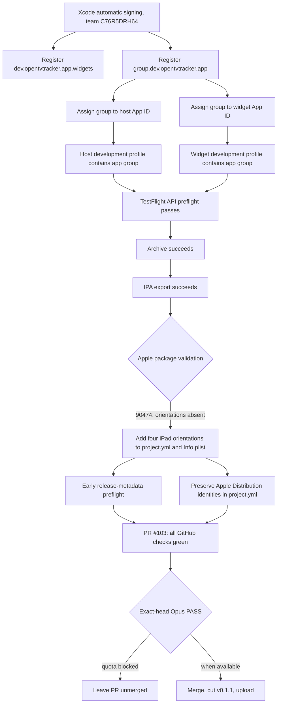

# 2026-07-27

## Session 1 — a workflow that could not be parsed, and the CI gap that hid it

### Symptom

Dispatching the TestFlight release failed with:

```text
HTTP 422: Workflow does not have 'workflow_dispatch' trigger
```

The trigger is right there in the file, and `--ref main` gave the same answer.

### Root cause

The preflight added the day before embedded a multi-line Python snippet to unwrap the DER
ECDSA signature. Its top-level statements sat at column 0, because Python requires that.
A YAML block scalar ends at the first column-zero line, so the document was truncated
mid-step:

```text
could not find expected ':' in ".github/workflows/testflight.yml", line 202, column 1
```

An unparseable workflow is not a failing workflow. GitHub cannot read its triggers, so the
file effectively ceases to exist — hence a 422 about a trigger that is plainly present.

### Fix

The Python is collapsed onto a single line, statements joined with `;`, so nothing in the
heredoc reaches column 0. Verified: all four workflows parse and report their triggers, and
the one-liner still produces an 86-character base64url signature (64 raw bytes) against a
throwaway P-256 key.

### The larger problem

This shipped through gitleaks, test-and-typecheck, build-and-test and CodeRabbit without a
murmur. Nothing in CI reads the workflow files, so nothing could notice that one of them had
stopped being a workflow. A new `workflow-syntax` job in the secret scan parses every file
under `.github/workflows` and fails on a YAML error or a missing trigger section.

Two details it has to get right:

- PyYAML resolves the unquoted key `on` to the boolean `True`, so the trigger check looks up
  both `True` and `"on"`.
- The job's own script is a heredoc inside a block scalar — the same shape that caused the
  bug. It is safe because YAML strips the block's common indentation before bash sees it, so
  the heredoc terminator lands at column 0. Confirmed by extracting the script from the
  parsed YAML and running it.

### Files changed

- `.github/workflows/testflight.yml` — DER unwrapping collapsed to one line, with a comment
  saying why it must stay that way.
- `.github/workflows/secret-scan.yml` — new `workflow-syntax` job.

### Next

Re-dispatch `testflight.yml` against `v0.1.0`. The tag does not move: `workflow_dispatch`
runs the workflow definition from the dispatched ref while checking out the requested tag.

## Session 2 — Apple signing repaired; App Store orientation gate found

**Status:** Implementation complete and all GitHub checks green; merge blocked only by the
required exact-head Opus verifier, which returned HTTP 429 with zero review tokens.

**Branch:** `codex/fix-testflight-orientations`

**PR:** #103

### System flow



### Affected components

| Layer | Components |
| --- | --- |
| Apple Developer | Widget App ID, app group, host/widget group membership |
| Release metadata | `Config/Info.plist`, `project.yml` |
| CI/CD | `.github/workflows/testflight.yml` |
| Delivery | PR #103, patch release required after merge |

### What was done

- [x] Used Xcode automatic signing with the existing signed-in team to register
  `dev.opentvtracker.app.widgets`.
- [x] Registered `group.dev.opentvtracker.app` and assigned it to both the host and widget
  App IDs.
- [x] Verified Apple-issued host and widget development profiles contain the exact app-group
  entitlement.
- [x] Re-dispatched TestFlight run `30242222834`; its protected App Store Connect preflight,
  archive, and IPA export all passed.
- [x] Captured Apple's next precise rejection: validator error 90474, because the
  iPad-capable host bundle declared no supported interface orientations.
- [x] Added all four required orientations to the XcodeGen source of truth and generated
  `Config/Info.plist`.
- [x] Added an early TestFlight metadata check so this defect fails before a costly archive.
- [x] Moved both Release `Apple Distribution` identities into `project.yml`; they had
  previously existed only in the generated project and were lost on regeneration.
- [x] Opened PR #103 at implementation commit `6d72f64`.
- [x] GitHub iOS, server, workflow-syntax, gitleaks, and CodeRabbit checks all passed.

### Key decisions

- **Decision:** Use Xcode automatic signing for the one-time Apple registration.
  - **Rationale:** The protected API key exists only in GitHub, while this Mac already had
    the correct Account Holder team signed into Xcode. Apple documents Xcode as a supported
    way to create app groups and update participating App IDs.

- **Decision:** Preserve `v0.1.0`; release the source fix as `v0.1.1`.
  - **Rationale:** Workflow-only repairs can safely retry an immutable tag, but orientation
    metadata changes the shipped source payload. Moving `v0.1.0` would make the release
    irreproducible.

- **Decision:** Require all four orientations rather than opting out of iPad multitasking.
  - **Rationale:** The app intentionally targets iPhone and iPad. Apple's validator named the
    complete four-orientation contract; weakening device support would hide the metadata bug.

- **Decision:** Leave PR #103 unmerged while the exact-head verifier is unavailable.
  - **Rationale:** Empty output and HTTP 429 are not an approval. All other gates are green,
    but the repository's cross-provider delivery contract requires an Opus PASS on the exact
    current head before merge.

### Files changed

- `.github/workflows/testflight.yml` — early orientation metadata preflight.
- `Config/Info.plist` — four supported interface orientations.
- `project.yml` — orientation source of truth and durable Release distribution identities.

### Mistakes and fixes

- A raw-target host build failed on SwiftPM module ordering after provisioning had already
  succeeded. Re-running the real scheme produced a clean full Release build; the target-only
  invocation was not representative of the release graph.
- Running XcodeGen initially exposed that the earlier signing repair lived only in the
  generated `.pbxproj`. The generated project reverted to development signing. Fixed the
  root source in `project.yml`, regenerated, and confirmed the `.pbxproj` retained the
  existing distribution identities without committing unrelated generated churn.
- The first exact-head verifier prompt was prepared before resolving the full commit SHA.
  The prompt was corrected to the exact pushed head before invocation; the verifier then
  returned HTTP 429 without consuming or producing review tokens.

### Verification

- Widget device build with automatic signing: succeeded and created the expected profile.
- Host and widget embedded profiles: both contain `group.dev.opentvtracker.app`.
- TestFlight run `30242222834`: API preflight, archive, and export passed; final validation
  reproduced only error 90474.
- Full unsigned Release build for generic iOS: `** BUILD SUCCEEDED **`.
- Processed Release Info.plist: contains all four required orientations.
- Release metadata negative probe: fails when a required orientation is absent.
- All workflow YAML files parse and retain trigger sections.
- All release plists pass `plutil -lint`.
- PR #103 checks: iOS build/test, server test/typecheck, workflow syntax, gitleaks, and
  CodeRabbit all passed.

### Next steps

- [ ] Run the Opus verifier against the exact current PR #103 head after the quota resets
  (July 31 at 07:00 Europe/Malta); require structured `PASS`.
- [ ] If the exact-head verdict passes and checks remain green, squash-merge PR #103.
- [ ] Cut and publish `v0.1.1` from the merged `main`; do not move `v0.1.0`.
- [ ] Watch the automatically triggered TestFlight workflow through validation and upload.
- [ ] Confirm the build appears in App Store Connect after Apple's processing queue.

## Session 3 — TestFlight partner invitations blocked by generated CloudKit schema

### Symptom

TestFlight `0.1.2 (100901)` installs successfully, but **Create private invitation** fails
while atomically saving the `PartnerSpace` root and its `CKShare`. The UI exposed the raw
CloudKit record identifier.

### Root cause

Production already contains the source-controlled `PartnerSpace` and `PartnerSpaceState`
types. The missing type is CloudKit's generated `cloudkit.share` type. Importing the
source-controlled custom schema cannot create it: a Development-signed app must first save
a real `CKShare`, then the generated schema change must be promoted in CloudKit Console.

This matches P0 issue #62 and Apple's rule that Production rejects unknown record types.


### What was done

- Confirmed the exact historical server error and remediation in issue #62.
- Built and ran the signed Development app on this Mac against
  `iCloud.dev.opentvtracker.app`.
- Created a real Development invitation for a dedicated schema-seed space. CloudKit
  returned an HTTPS share URL, proving `cloudkit.share` is now seeded in Development.
- Added safe action-specific error mapping for invite, accept, revoke, and leave operations.
- Corrected the availability path so a missing container configuration is not reported as
  an iCloud-account problem.
- Added regression tests proving raw record details do not reach the user.
- Updated the CloudKit runbook and public release checklist with the generated sharing-type
  gate.
- Committed and pushed `820c440`; opened PR #105.
- Added a progress comment to issue #62 without closing #62 or #46.

### Verification

- Signed Development CloudKit seed: passed and returned a real HTTPS share URL.
- Final focused simulator suite: 7 tests passed, 0 failures.
- Workflow syntax, gitleaks, and server test/typecheck checks passed on PR #105.
- iOS CI was still running at the handoff point.
- Fable/Opus planning and verification lanes remain constrained by the previously observed
  provider reset window; no approval was inferred from a failed or empty model call.

### Remaining gate

- [ ] Complete Apple ID/2FA sign-in in the CloudKit Console tab already opened in Brave.
- [ ] Select `iCloud.dev.opentvtracker.app` and deploy the pending Development schema changes.
- [ ] Verify `cloudkit.share` is visible in Production.
- [ ] Retry invitation creation on the existing TestFlight build; no new binary is required
  for the schema repair.
- [ ] Complete the two-account invitation, acceptance, bidirectional sync, offline retry,
  revoke, leave, and relaunch checks before closing #62/#46.
- [ ] Merge PR #105 only after its checks are green and the requested runtime acceptance
  gate is complete.
