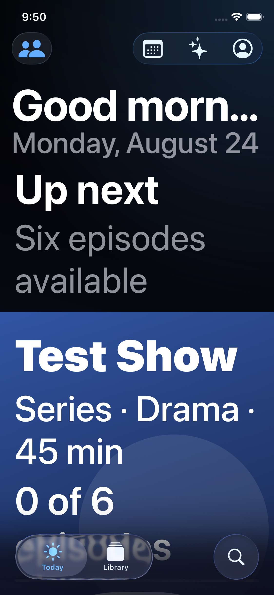
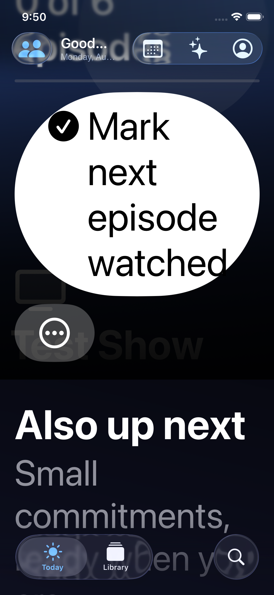
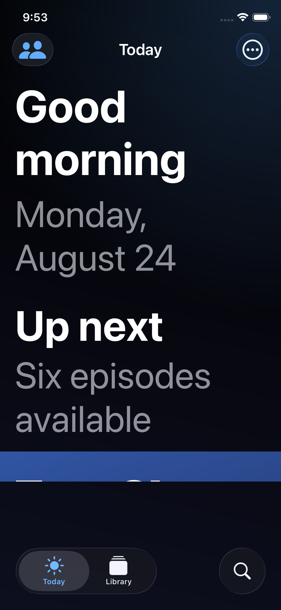
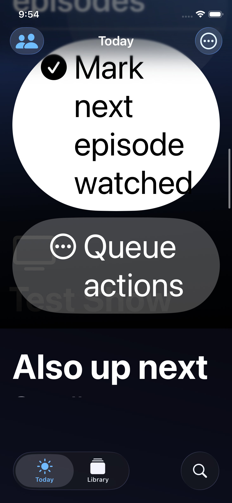
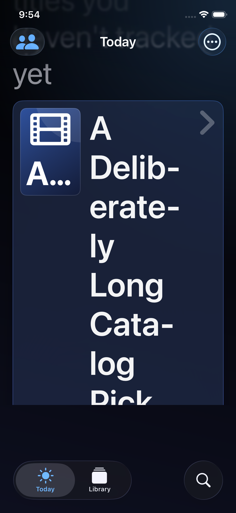
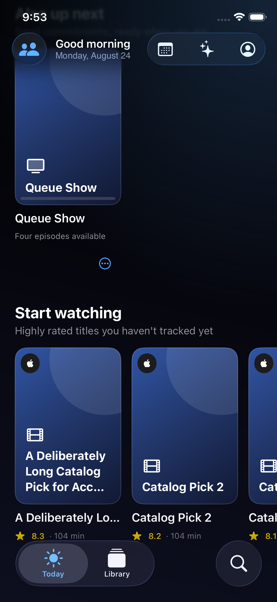

# Issue #138 — Today AX5 evidence

These are unedited XCUITest screenshot attachments captured on 2026-08-24 from an
OpenTV iPhone 11 Pro simulator (iOS 26.5, Xcode 26.6). The app launched with the
deterministic `-ui-testing-core-journeys` seed. AX5 runs additionally used
`-UIPreferredContentSizeCategoryName UICTContentSizeCategoryAccessibilityXXXL`.

The PNG files were exported directly from the `.xcresult` bundles with
`xcrun xcresulttool export attachments`. They were not cropped, annotated,
resized, re-encoded, or reconstructed.

## Provenance

- **Before:** app source at `b1b3e82fec02dee236b62b107f6b9d130da8394d`
  (`origin/main` before this fix). A temporary test-only recorder was added in a
  detached worktree; production source was unchanged. The successful AX5 capture
  is in `/tmp/pr153-before-ax5-evidence.xcresult`.
- **After:** app source at `c44a6b6ac2b34bf1b98f8f57362af5cc8a8a2f4b`
  (the repaired implementation merged normally with that `origin/main`). The only
  uncommitted source difference during capture
  added the two named default screenshot attachments to the persistent UI test.
  Both focused tests passed in `/tmp/pr153-merged-focused.xcresult`.

## Before: AX5 obstruction and truncation

At rest, the greeting truncates and the oversized hero extends behind the bottom
chrome:



After the first upward scroll, the hero action consumes the viewport and content
remains obscured by the bottom chrome:



## After: AX5 reflow and reachable controls

The greeting wraps in full, the toolbar collapses to one reachable menu, and the
Today viewport stops above the bottom chrome:



The hero progress action can be scrolled completely above the bottom chrome:



The Start watching shelf has no nested horizontal scroll view at AX5. Its cards
become aligned, full-width vertical rows; the focused test also asserts the full
long title is exposed in the accessibility label without an ellipsis:



## After: default Dynamic Type remains horizontal

At default Dynamic Type the same shelf intentionally retains its compact poster
cards and horizontal browsing behavior. The focused test asserts a card is less
than 60% of the device width and moves horizontally after a left swipe:



## Integrity

```text
97d40477b3ce89848efbe281e03c025b9675ad54a1df5b4e009a13e8a0fc4d6d  after-ax5-initial.png
1375a79e36730b74c7e49f991d85d85636b6cd2c8d7fba7cb1601b6b23717a51  after-ax5-mark-next-clear.png
482e6f6d17581356e2bf2f8ba9680fa599882647f4f02afa08235ba8daff17c3  after-ax5-vertical-shelf.png
b5ef870447c80921a1c44ad7396390d1497e0b511afb065e26eb43b6fa62c636  after-default-horizontal-shelf.png
a3f3c43153863180b052d1f93af5908d89f3b86cf6d24370695571762826d0b4  before-ax5-after-first-scroll.png
80eb626735ac462b8807c3999f6861fddc88a2cb1a226ac3090e7221722e8114  before-ax5-initial.png
```
